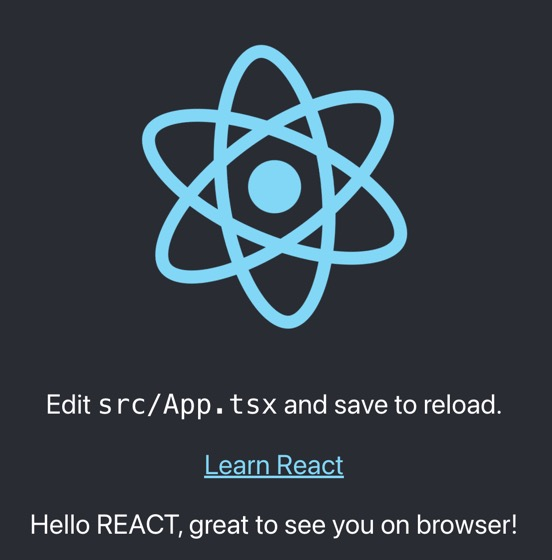
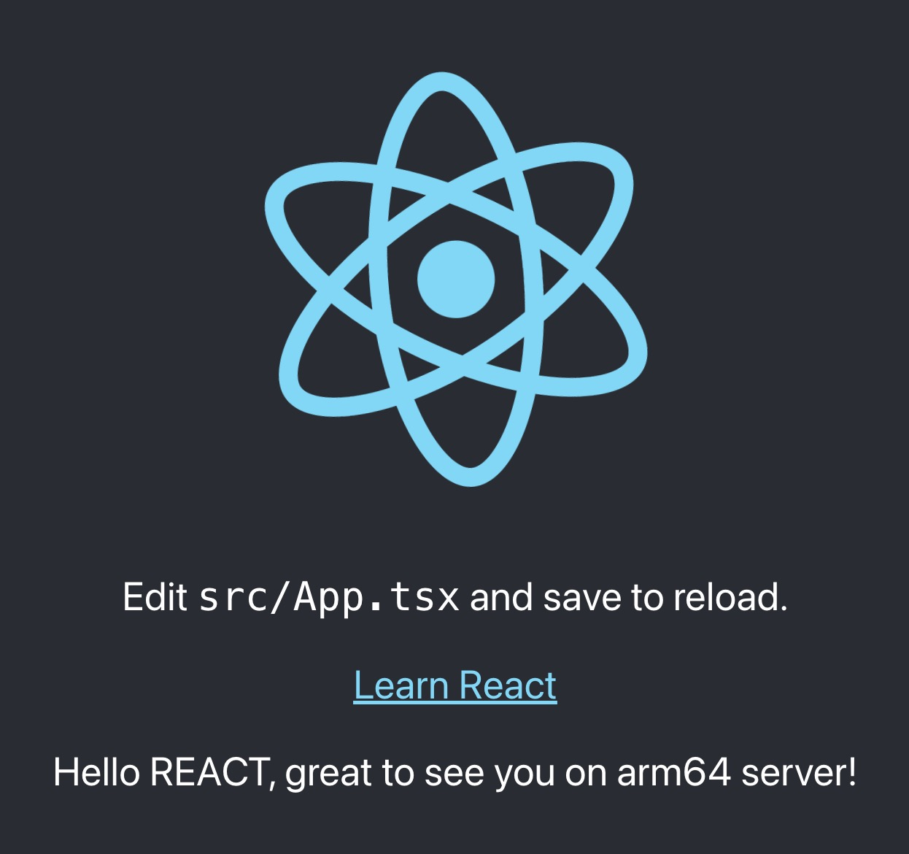
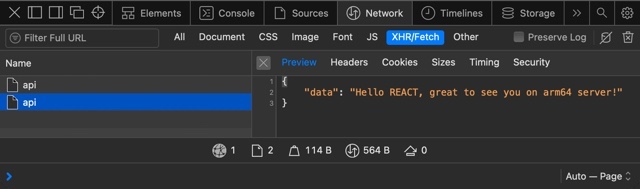
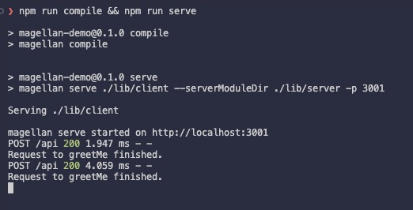

<!--
 ---------------------------------------------------------------------------------------------
   Copyright (c) Quatico Solutions AG. All rights reserved.
   Licensed under the MIT License. See LICENSE in the project root for license information.
 ---------------------------------------------------------------------------------------------
-->

# Magellan

[](https://github.com/quatico-solutions/magellan/actions/workflows/protect-stable.yml)  [](https://www.npmjs.com/search?q=%40quatico)

The Magellan project provides compiler tooling and a runtime API for remote execution of
service functions written in TypeScript.

In many applications, backend developers have to create REST APIs, e.g., using swagger.io. Frontend developer implement
client code in their components to present domain logic and data in the browser. During the development developers in
frontend and backend have numerous discussions about this API, followed by changes and extensions on both sides.
Magellan simplifies this process by providing a compiler that generates all involved code for both sides.

Magellan is a TypeScript library that provides a compiler and runtime API for service functions with the following features:

- Transparent support to write services that consume node modules in the frontend
- npm package generation of TypeScript server code for remote execution through node
- (Almost) invisible transport layer between browser and node.
- Effortless configuration of service endpoints
- Automatic serialization of input/output values
- Transparent error messages and exception handling

## 1 Prerequisites

Before you can use Magellan, you need to install the dependencies. You'll need a working Node environment with Node 16+, npm and npx (or yarn 1.20.0+)

```bash
npm -v  # 8.14.0
npx -v  # 8.14.0
node -v # v16.15.1
```

Windows users please note that we don't fully support Windows yet, but we are working on it.

## 2 Getting Started

Let's implement a small frontend application with a service that returns a greeting and
a [React](https://reactjs.org/) component that displays it in the browser. This service will automatically be extracted from the frontend code and be executed on the server.

## 3 Create a react application

```bash
npx create-react-app magellan-demo --template typescript 
```

and open the project in your favorite IDE for example in Visual Studio Code using

```bash
code magellan-demo
```

### 3.1 Create service function for "GreetingService'

Create a new folder `src/services` to contain your server scripts files.
Add an example function that returns a greeting `src/services/greet-me.ts`:

```typescript
export const greetMe = async (name: string): Promise<string> => {
    // In the browser, accessing process.arch causes an error.
    return `Hello ${name}, great to see you I'm Magellan running on "${ typeof window === "undefined" ? `${process.arch}" server`: "browser"}!`;
}
```

### 3.2 Use the service in the application

Update `src/App.tsx` to use the greeting service and show the greeting to the visitor.

```diff
+ import { useEffect, useState } from "react";
import logo from './logo.svg';
+ import { greetMe } from "./services/greet-me";

import './App.css';

function App() {
+  const [greeting, setGreeting] = useState("... waiting for greetings ...")
+
+  useEffect(() => {
+    greetMe("REACT")
+      .then(setGreeting)
+      .catch((reason) => {
+        console.error(`Error requesting greeting: ${reason}`);
+        setGreeting("server does not wish to greet us");
+      });
+  }, []);
    
  return (
    <div className="App">
      <header className="App-header">
        
        <p>
          Edit <code>src/App.tsx</code> and save to reload.
        </p>
        <a
          className="App-link"
          href="https://reactjs.org"
          target="_blank"
          rel="noopener noreferrer"
        >
          Learn React
        </a>
+       <p>{greeting}</p>
      </header>
    </div>
  );
}

export default App;
```

When we now start the react application

```bash
npm start
```

The react app at [http://localhost:3000](http://localhost:3000) presents us with greetings by the service running in the browser



Lets add Magellan now to have the service executed on the server instead.

## 4 Adding Magellan

Thus far, we have prepared magellan-demo to have a isolated service function with well defined input and output (string in our case, but this can be any well defined structure). Now it is time to add Magellan to magellan-demo, enabling it to automatically move the service function to the server without any change to the frontend code or the need to add networking and serialization.

### 4.1 Setup the project to use Magellan

Install the required packages in the magellan-demo project.

```bash
npm i -D @quatico/magellan-addons @quatico/magellan-cli @quatico/magellan-client @quatico/websmith-webpack react-app-rewired
```

Update the `package.json` to use [react-app-rewired](https://www.npmjs.com/package/react-app-rewired) and magellan

```diff
{
    ...
    "scripts": {
-       "start": "react-scripts start",
+       "start": "react-app-rewired start",
-       "build": "react-scripts build",
+       "build": "react-app-rewired build",
-       "test": "react-scripts test",
+       "test": "react-app-rewired test",
        "eject": "react-scripts eject",
+       "compile": "magellan compile",
+       "serve": "magellan serve ./lib/client --serverModuleDir ./lib/server --port 3001"
    },
    ...
}
```

Update `tsconfig.json` to enable TypeScript to generate output

```diff
{
    "compilerOptions": {
        ...
-       "noEmit": true,
+       "outDir": "./lib/client",
    }
}
```

With these changes, everything is ready for us to add the configurations required to enable Magellan to automatically take our service function and generate frontend and server code within the create-react-app context.

#### 4.1.1 Configure react-app to execute additional steps

Create a file `config-overrides.js` in the magellan-demo directory, that [react-app-rewrited](https://www.npmjs.com/package/react-app-rewired) will use.

```js
const { join } = require("path");

const isProduction = process.env.NODE_ENV === "production";

const websmithConfig = {
  debug: process.env.NODE_ENV === "debug",
  sourceMap: !isProduction,
  project: join(__dirname, "tsconfig.json"),
  config: join(__dirname, "websmith.config.json"),
  targets: "client,server",
};

module.exports = {
  webpack: function override(config, env) {
    config.module.rules.push({
      test: /\.[jt]sx?$/,
      include: [
        join(__dirname, "src"),
        join(__dirname, "node_modules", "@quatico", "magellan-client"),
      ],
      exclude: [/\.spec\.tsx?$/, /node_modules/],
      loader: "@quatico/websmith-webpack",
      options: websmithConfig,
    });

    return config;
  },
};
```

### 4.1.2 Configure magellan

Create a file `websmith.config.json` in the magellan-demo directory with the following content

```json
{
    "addonsDir": "./node_modules/@quatico/magellan-addons/lib",
    "targets": {
        "client": {
            "writeFile": false,
            "addons": ["client-function-transform"],
            "config": {"functionsDir": "./src/services"}
        },
        "server": {
            "writeFile": true,
            "addons": ["service-function-generate"],
            "config": {"functionsDir": "./src/services" },
            "options": {"outDir": "./lib/server","module": 1}
        }
    }
}
```

### 4.2 Annotate greetMe as a service

Update function `greetMe` in `src/services/greet-me.ts` and annotate it as a service.

```diff
+// @service()
export const greetMe = async (name: string): Promise<string> => {
    return `Hello ${name}, great to see you on ${ typeof window === "undefined" ? `${process.arch} server`: "browser"}!`;
}
```

### 4.3 Update the Application to connect to the server

create-react-app requires us to run the Magellan server in parallel to the react-scripts server, so we need to to configure the location where the server is running.
To do so, we need to add the following code to `src/App.tsx`

```diff
import { useEffect, useState } from 'react';
import logo from './logo.svg';
import { greetMe } from "./services/greet-me";
+ import { setNamespace } from "@quatico/magellan-client"

import './App.css';

+ // to serve the frontend through react-scripts and run the server along it, we need to tell magellan
+ // that the server is on a different port than where it is served from.
+ setNamespace("default", { endpoint: "http://localhost:3001/api" });

function App() {
 ...
}

export default App;
```

### 4.4 Run react and magellan

We will now use a second terminals to run the react App in addition to the magellan server at the same time. Open another terminal and run the following commands:

#### Magellan Server Terminal

```bash
npm run compile
npm run serve
```

> NOTE: If you run into compilation problem "Error: 1208: 'App.test.tsx' cannot be compiled under '--isolatedModules' because it is considered a global script file. Add an import, export, or an empty 'export {}' statement to make it a module." <br>
> Remove the line `"isolatedModules": true,` from your `tsconfig.json`

The React page at [http://localhost:3000](http://localhost:3000) now shows us that we successfully received the greeting executed by the service on the node server.



In the DevTools of your browser you'll see the new network calls to the server for executing the `greetMe` function:



We can also see this in the servers terminal


