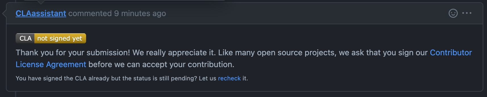

<!--
 ---------------------------------------------------------------------------------------------
   Copyright (c) Quatico Solutions AG. All rights reserved.
   Licensed under the MIT License. See LICENSE in the project root for license information.
 ---------------------------------------------------------------------------------------------
-->
# Contributing to Magellan

There are three great ways to contribute to the Magellan project: logging bugs, submitting pull requests, and creating suggestions.

## Logging Bugs
To log a bug, just use the GitHub issue tracker. Confirmed bugs will be labelled with the Bug label. Please include code to reproduce the issue and a description of what you expected to happen.

## Pull Requests
Before we can accept a pull request from you, you'll need to sign the Contributor License Agreement (CLA). On your first pull request, you will be requested to the CLA through a message similar to the following .

Be sure to follow our Coding Guidelines.

## Suggestions
We're also interested in your feedback in future of Magellan. You can submit a suggestion or feature request through the issue tracker. To make this process more effective, we're asking that these include more information to help define them more clearly.
