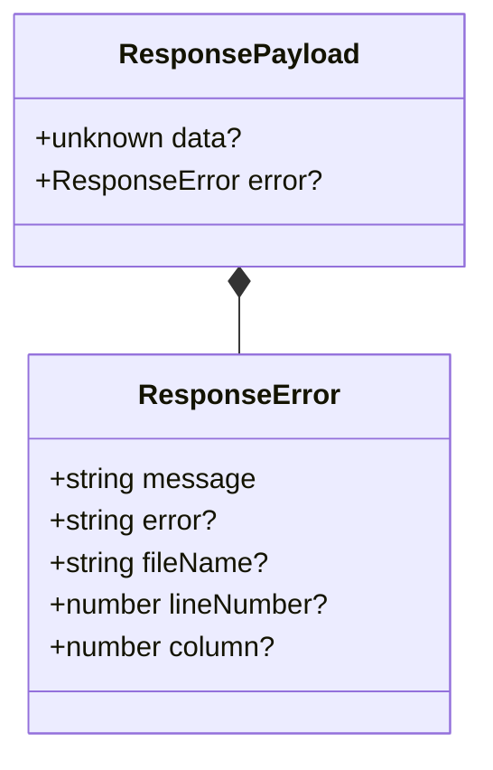

# Error propagandation of service functions from server to client

magellan supports automatic error propagandation from the server executed version of a @service annoted function to the frontend.
This propagandation acts differently depending on the backend being executed in production mode (NODE_ENV production) or not.

In production, only the field `message` is provided which always contains the same structured message: "Function request to "${nameOfFunction}" failed."
In development, the message contains additional informations from the original server-side error and will write an error log containing a error object.

- **error:** The full error message including stack from the server.
- **fileName, lineNumber, column:** The extracted error information if available, used to fully reconstruct the error object on the client to make 'jump to error' interactions possible.

