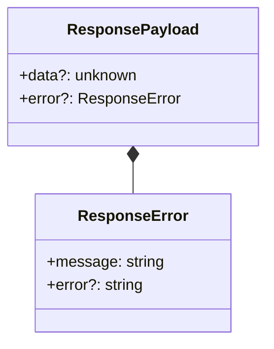
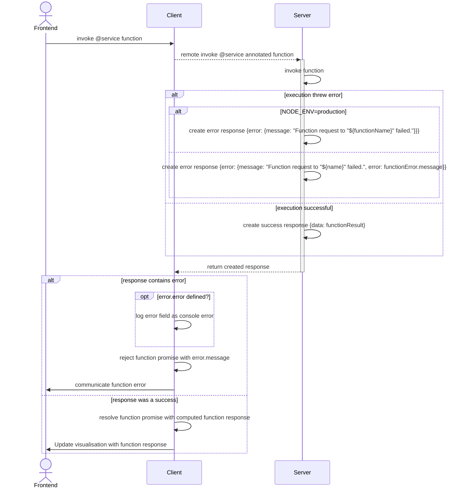

<!--
 ---------------------------------------------------------------------------------------------
   Copyright (c) Quatico Solutions AG. All rights reserved.
   Licensed under the MIT License. See LICENSE in the project root for license information.
 ---------------------------------------------------------------------------------------------
-->
# Response and error propagation of service functions from server to client

magellan supports automatic error propagation from the server executed version of a @service annoted function to the client.

## Data Structure

The following is the server response payload which will automatically be handled by magellan-client and provided to the @service functions promise.



### ResponsePayload

- **data:** function result. Used for the @service functions promise resolution.
- **error:** Error object. Used for the @service functions promise rejection.

### ResponseError

- **message:** Non-technical error message naming failed function. Used as @service function promise reject reason.
- **error:** Full error message including callstack from the server.
  - This field is only provided if NODE_ENV is not `production`.
  - This information will be written to console.error if present.

**Important:** The response received from the server always only includes the field data or error, but never both.

## Flow



## Response Examples

### Success

```json
{ "data": { "fibonacciValue": 8 } }
```

### Error in production

```json
{
    "error": {
        "message": "Function request to \"calculateFibonacci\" failed."
    }
}
```

### Error in development

```json
{
    "error": {
        "message": "Function request to \"calculateFibonacci\" failed.",
        "error": "at /app/src/services/fibonacci.ts:32:17\n . value is undefined"
    }
}
```
