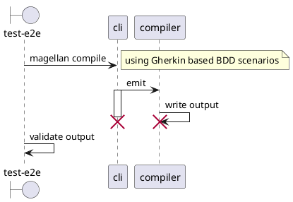

<!--
 ---------------------------------------------------------------------------------------------
   Copyright (c) Quatico Solutions AG. All rights reserved.
   Licensed under the MIT License. See LICENSE in the project root for license information.
 ---------------------------------------------------------------------------------------------
-->

# @quatico/magellan-test

This is a end to end test suite for the magellan suite using cucumber-js and BDD scenarios. The test suite is executed as part of the Magellan
projects e2e tests (yarn test:e2e) as well as the distribution profile

```sh
yarn lib
```

## Usage

```sh
yarn test:e2e
```

